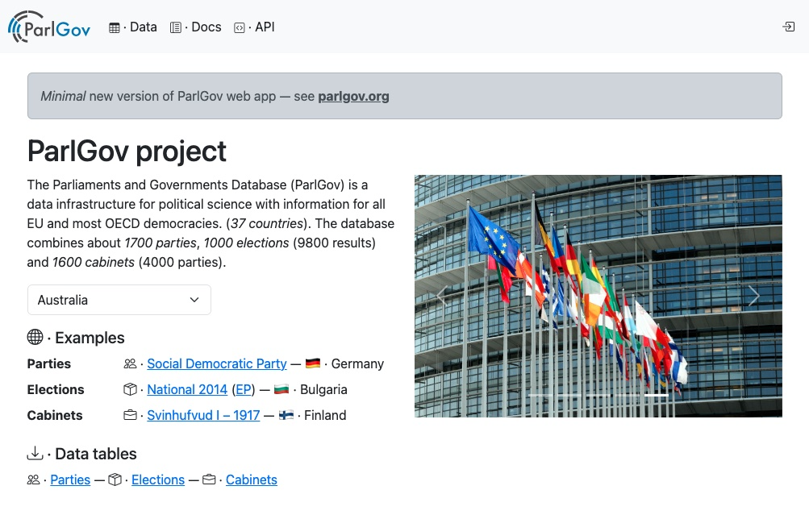

# ParGov web · 🗳️

A reimplementation of the Parliaments and governments database
([ParlGov](https://parlgov.org/))

See [parlgov.fly.dev](https://parlgov.fly.dev/) and [docs](./docs).

## Usage · 💡

For local use, see the initialization example in
[./scripts/init-dev-project.sh](./scripts/init-dev-project.sh).

Run the local development version at [localhost:8000](http://localhost:8000/).

```sh
# (.venv) ./app
python manage.py runserver
```

## License · ⚖️

[MIT](https://choosealicense.com/licenses/mit/) — Holger Döring

Data from [ParlGov
Dataverse](https://dataverse.harvard.edu/dataset.xhtml?persistentId=doi:10.7910/DVN/2VZ5ZC)
is licensed [CC0 1.0](https://creativecommons.org/publicdomain/zero/1.0/).

---


