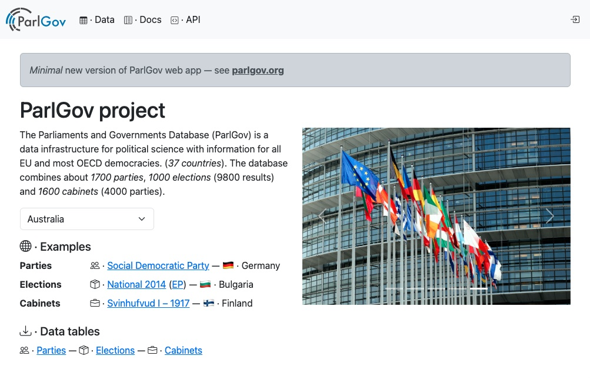

# ParGov web · 🗳️

A reimplementation of the Parliaments and governments database
([ParlGov](https://parlgov.org/)). The project is now in maintenance mode,
receiving only security updates (see [post 2024-10-01](https://parlgov.org/2024/10/01/retiring-from-parlgov/)).

See [parlgov.fly.dev](https://parlgov.fly.dev/) and [docs](./docs).

Python and Django versions are specified in [`pyproject.toml`](./pyproject.toml)
and documented in the [changelog](./CHANGELOG.md).

## References · 🗂️

- Döring, Holger. 2025. “Advancing Data Infrastructures on Democratic
  Representation: An Open-Source Version of ParlGov.” SOCIUM SFB 1342 Working
  Papers. — DOI: [10.26092/elib/4362](https://doi.org/10.26092/elib/4362)
- Döring, Holger. 2024. “ParlGov Source Code: A Web Application for Managing
  Data on Parties, Elections, and Cabinets.” Zenodo. — DOI:
  [10.5281/zenodo.14357360](https://doi.org/10.5281/zenodo.14357360)
- Döring, Holger, and Philip Manow. 2024. “ParlGov 2024 Release.” Harvard
  Dataverse. — DOI: [10.7910/DVN/2VZ5ZC](https://doi.org/10.7910/dvn/2vz5zc)

## Usage · 💡

For local use, see the initialization example in
[./scripts/init-dev-project.sh](./scripts/init-dev-project.sh).

Run the local development version at [localhost:8000](http://localhost:8000/).

```sh
# (.venv) ./app
python manage.py runserver
```

## License · ⚖️

[MIT](./LICENSE)

Data from [ParlGov
Dataverse](https://dataverse.harvard.edu/dataset.xhtml?persistentId=doi:10.7910/DVN/2VZ5ZC)
is licensed [CC0 1.0](https://creativecommons.org/publicdomain/zero/1.0/).

---


