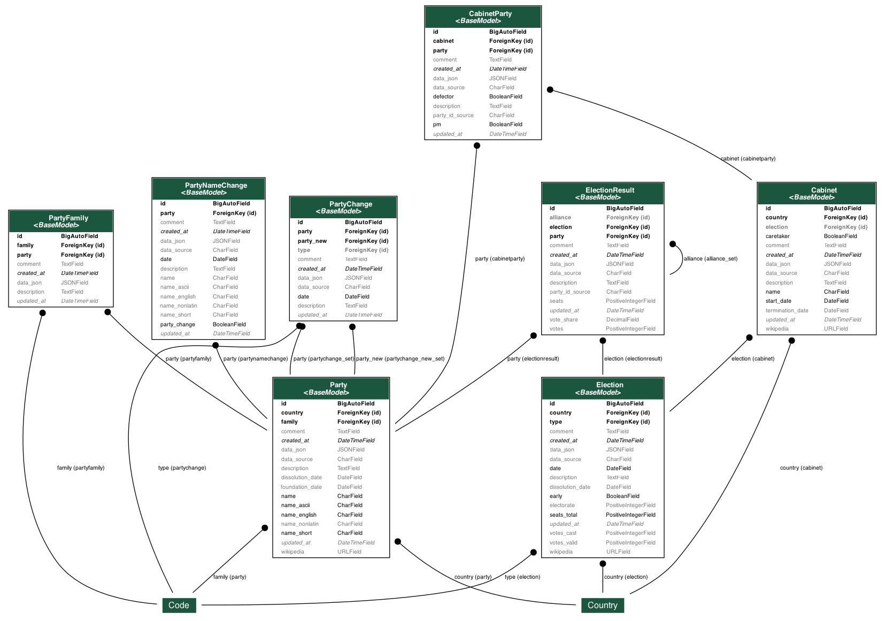

# Development · 💻

See Python development dependencies in `requirements-dev.txt` and a
documentation of environment variables in `.env.example`.
[uv](https://docs.astral.sh/uv/pip/) is used as a _venv/pip_ replacement for
some development tasks.

## Commands · 🏃🏼

Use [just](https://just.systems/man/en/chapter_20.html#quick-start) command
runner for local development and in codespace.

List commands with

```sh
just
```

## Testing · 🧪

Run tests and check test coverage with

```sh
# ./app
pytest --cov
```

Tests are run randomly with
[pytest-randomly](https://github.com/pytest-dev/pytest-randomly). This can be
disabled with

```sh
pytest --cov --randomly-dont-reorganize
```

## Database · 🫙

### Tables · 📂

Database tables use prefixes.

- _data_ — data tables (e.g., parties, elections, cabinets)
- _docs_ — documentation tables (e.g., codebook, news)
- _view_ – main data tables (database views, _see below_)

Additional tables are included by Django in the app database (`parlgov.sqlite`).

A visualization of the data tables is provided in `graph-models_data.png` (see
below).

### Normalization · ✔️

The database created with the Django models is _normalized_ except for the
`election` attribute of the `Cabinet` model. An _election_ is added or updated
to a _cabinet_ on save. A later change to the _election_ that changes the
previous election for the _cabinet_ is not updated for the _cabinet_
automatically.

All cabinets' elections can be checked and updated with

```sh
# ./app
python manage.py update_cabinet_election
```

### Views · 🔬

There are three main tables (parties, elections, cabinets) provided as database
views. They include the most frequently used information from the primary
database tables.

These views are created during the initialization of the project (see [Data
import](/usage/#data-import)).

The three main views are not included as Django models in the project.

## Miscellaneous · 🗂️

### Documentation · 📚

Start documentation at [localhost:80](http://localhost:80/)

```sh
mkdocs serve --dev-addr localhost:8888
```

### Graph models · 📐

Create or update [graph
models](https://django-extensions.readthedocs.io/en/latest/graph_models.html#example-usage)
— locally only

```sh
./scripts/graph-data-models.sh
```

The script needs _graphviz_ installed and is included only locally to keep
testing, Docker, and codespace configuration lean.

Install on macOS with homebrew

```sh
brew install graphviz
```

Install on Ubuntu and Debian (e.g., codespace) with

```sh
sudo apt-get install graphviz graphviz-dev
```

---


