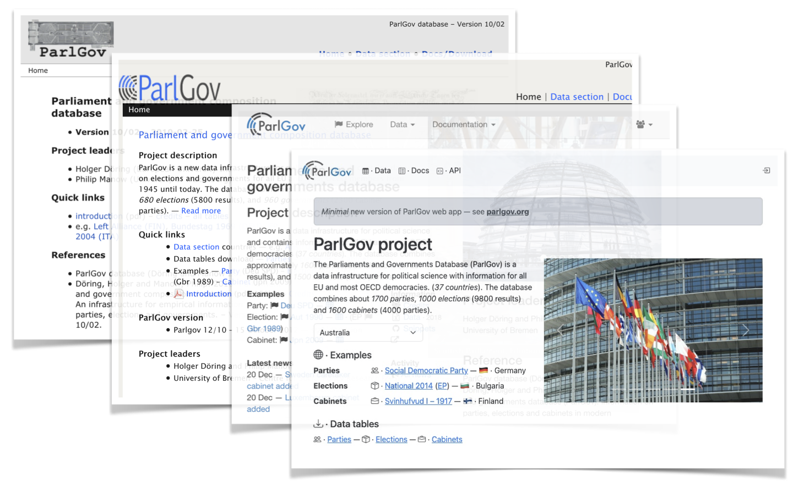

# ParGov web · 🗳️

A reimplementation of the Parliaments and Governments Database
([ParlGov](https://parlgov.org/))

[parlgov.fly.dev](https://parlgov.fly.dev/) · 🌐
— [github.com/hdigital/parlgov-web](https://github.com/hdigital/parlgov-web) · 🛠️

---

The project reimplements ParlGov (_ParlGov legacy_) and provides a minimal,
maintainable, and tested code base (_ParlGov web_). The reimplementation uses
best practices for Django code and modern Python tools. The main data tables,
pages, and validations have been migrated for an initial version.

---

