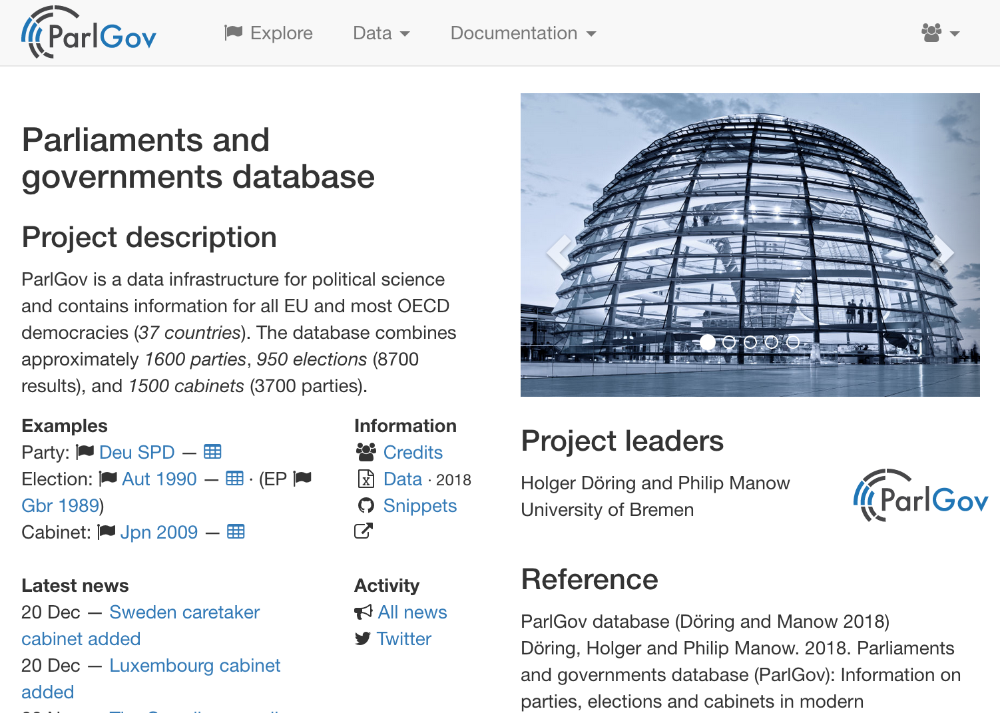

# Migration · 👣

## Approach

The main data tables and some of the docs have been migrated from _ParlGov
legacy_ and are presented on _ParlGov web_
(see `./scripts/migrate_parlgov-db/`). The SQLite database
`parlgov-experimental.db` (see [ParlGov Dataverse](https://dataverse.harvard.edu/dataset.xhtml?persistentId=doi:10.7910/DVN/2VZ5ZC))
is used for the migration. A mapping of the migrated tables and their new table
names is provided in `migration-check.csv`.

The main information is summarized in the tables`view_party`, `view_election`,
and `view_cabinet`, which are included as database views.

Database tables now include a `data_*` or `docs_*` prefix to distinguish them
from the database tables created by Django.

All tables include a `created_at` and an `updated_at` column. The values are set
to the date of the migration import and do not record an entry's initial coding
and last update.

Codes used in the variable `type_id` are documented in the table `data_code`.

## Parties

**Parties**, **party families**, **name changes**, and **party changes** have
been migrated from _ParlGov legacy_.

[Party Facts](https://partyfacts.org/) provides a link file with ParlGov IDs,
which should be used to link party IDs with other datasets. Party IDs from Party
Facts, Manifesto, and CHESS are not included in _ParlGov web_.

Party positions and party IDs from other datasets were not updated for recent
versions of _ParlGov legacy_.

## Elections

**Election results** have been migrated from _ParlGov legacy_.

_ParlGov legacy_ includes tables that record changes in the composition of
parliaments (`parliament_change`) and parliament compositions
(`parliament_composition`). This data is used to calculate the seat strength of
cabinet parties based on `viewcalc_parliament_composition`. The data and the
scripts for the calculation have not been migrated.

## Cabinets

**Cabinet parties** have been migrated from _ParlGov legacy_.

Cabinet seats have not been included (see above).

_ParlGov legacy_ includes an experimental and incomplete recording of
_confidence votes_ and _cabinet support parties_ that have not been migrated to
_ParlGov web_.

## Docs

**Codebook pages** and **news** entries have been migrated from _ParlGov
legacy_.

All database tables and variables are documented in _ParlGov legacy_, which
includes checks to ensure the documentation covers all tables and variables.
This documentation and the checks have not been migrated for the initial version
of _ParlGov web_. _ParlGov legacy_ also includes a table that documents JSON
keys.

Data sources are documented with keys in the data tables and these keys are
mostly documented and checked in _ParlGov legacy_. A migration of the keys needs
a substantial revision and is not included in the initial version of _ParlGov
web_.

## External

_ParlGov legacy_ includes additional information, such as party IDs and party
names from other datasets, in database tables with the prefix `external_*`.

These tables were not updated for recent versions of _ParlGov legacy_ and are
not needed in a new version of ParlGov.

---

