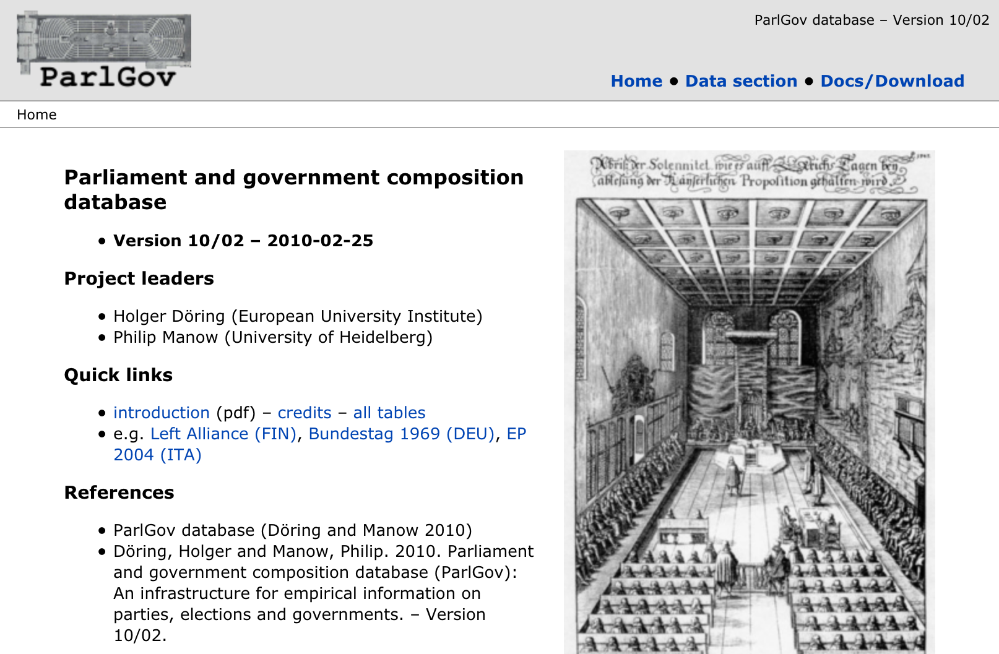

# Project history · 👴🏼

This summary of _ParlGov legacy_ describes the significant steps of the code
evolution and summarizes its shortcomings. A public version of the web page was
accessible between 2010 and 2021.

## History

The earliest Django version of ParlGov I found is from 2007. It was based on a
SQLite database I created previously. I liked Django right away but was hesitant
to tie the project to the framework fully. Hence, I initially implemented the
Django web app as a "user interface" to the database and started hosting it on
Webfaction. At the time, I did not follow the best practices recommended by
Django but kept the focus on the database. It was also the time when I learned
more advanced Python programming concepts through learning Django. This legacy
is still visible in the code more than a decade later.

I completed and made public an initial version of the page in 2010. At the time,
I updated and significantly improved the structure of the database and the
models by using better table and variable names as well as by restructuring the
database. This year, I also started using version control, Mercurial at the
time, so that all changes since 2010 can be tracked. Before 2010, the web app
required a login.

In 2014, I conducted a major refactoring of the codebase and added the Bootstrap
CSS framework, which led to a significantly more professional page layout.

Even in 2015, I knew that the web app needed significant refactoring. Newer
Django versions depreciated some approaches that the code relied on, Python 3
became mainstream, and there was too much outdated code.

Between 2015 and 2021, I could not find funding to implement a refactoring, and
I was not in a position to do these updates myself. That is why the project code
base stalled, although it was happily running online all those years. During
this period, I added data validations, minor bug fixes, and minuscule
enhancements.

In 2021, our web hosting provider, Webfaction, was closed, and _ParlGov legacy_
was no longer publicly accessible. The main information about the project, news,
and data were now provided with a static page at _parlgov.org_. At the time, I
created a Docker configuration that allows to run the legacy version locally,
and that has been used to create stable releases. Internally, we used web
hosting at PythonAnywhere to run the legacy app and to update the data. The page
was not publicly available due to performance and security issues.

In 2024, I reimplemented the main models, pages, and data checks in _ParlGov
web_. The new implementation and the data import revealed some minor data issues
that were fixed in _ParlGov legacy_ before the stable release. A final stable
release based on the legacy app was published in 2024.

## Legacy issues

What are the primary dead ends in the code base that make a migration of
_ParlGov legacy_ without a reimplementation so challenging?

First, the database is not aligned with _Django migrations_. SQLite does not
enforce data types. The original data was not added through Django and was
edited manually, so that there are some inconsistencies in the database.
Migrations were added to Django only in the early 2010s, and the apps' models
can not be altered with Django migrations.

Second, the project has not been migrated to _newer Django versions_. Django
introduced some new approaches and depreciated previous approaches. Some better
best practices have evolved in the Django community, but none of them have been
included in the code base.

Third, the entire _project structure is opaque_. In the early parts of the
project, I ran into issues with circular imports, so I ended up implementing
Django apps that are way too large.

Fourth, views and _templates are too complex_ and too large to repair. They have
evolved over the years, adding features without properly structuring or
modernizing.

Fifth, _no tests_ are included in the code base, so modifying and updating the
app is risky and potentially error-prone.

Sixth, _frontend technologies_ have evolved over the last decade. None of these
tools, Bootstrap as an exception, is used in the app.

Nevertheless, I firmly believe that the models have stood the test of time.
There are a few minor adjustments I would like to make, and many removals are
needed. I am convinced that the major models are very robust and include a lot
of valuable experience gained over the years.

Therefore, the new version is based on the models from the legacy app. All other
code has been written from scratch, and this is not a "second system syndrome"
but a hard-won insight.

---

